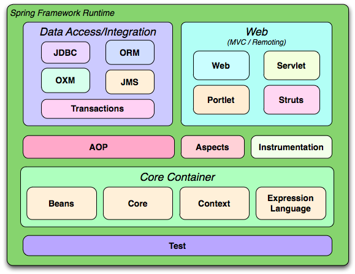

# Spring framework

The Spring Framework provides a comprehensive programming and configuration model for modern java-based enterprise applications - on any kind of deployment platforms.

A key element of Spring is infrastructual support at the application level: Spring focuses on the "plumbing" of enterprise applications so that teams can focus on application-level business logic, without unnecessary ties to specific deployment environments.

# Features

## Core Technologies:

- Dependency injection
- Events
- Resources
- i18n
- validation
- data binding
- type conversion
- SpEL
- AOP

## Data Access

- Transactions
- DAO support
- JDBC
- ORM
- Marshalling XML

## Spring MVC and Spring WebFlux web frameworks

## Integration

## Languages

- Kotlin
- Groovy
- dynamic languages

# References

- https://spring.io/projects/spring-framework
- https://spring.io/projects/spring-framework#overview
- https://docs.spring.io/spring/docs/3.0.x/spring-framework-reference/html/overview.html
